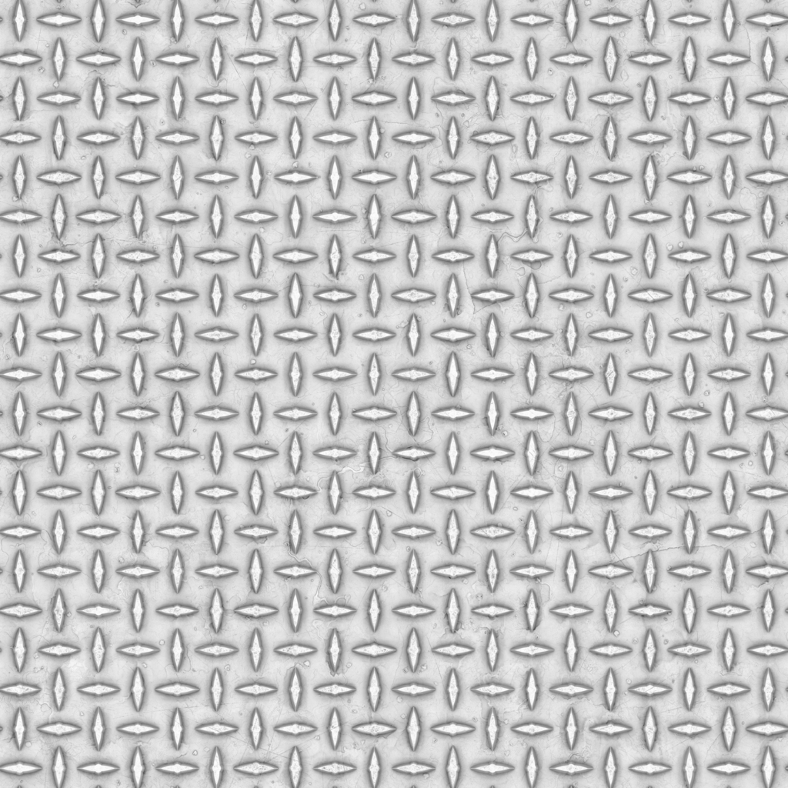
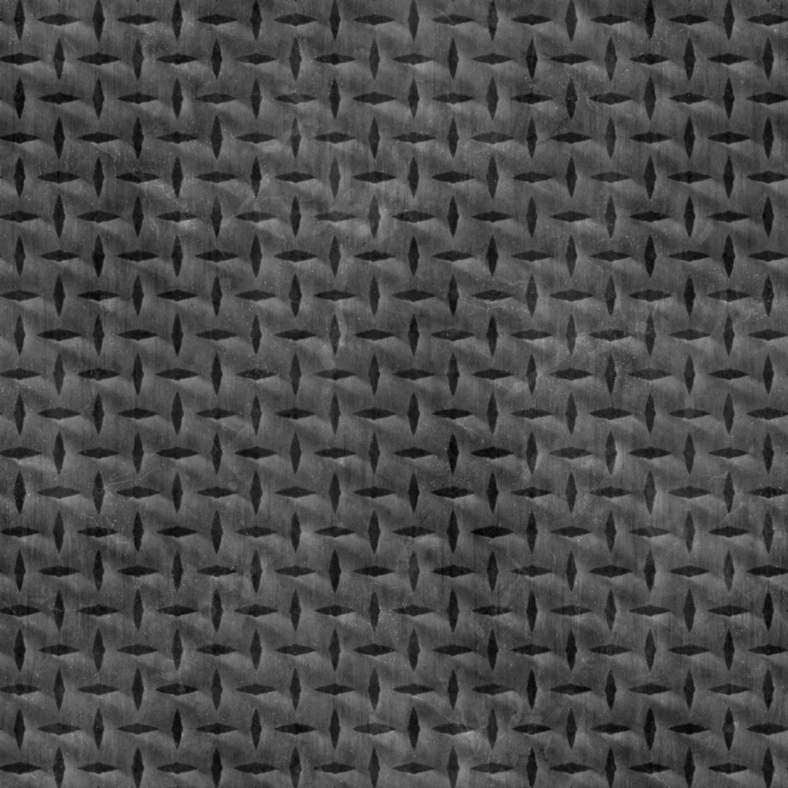
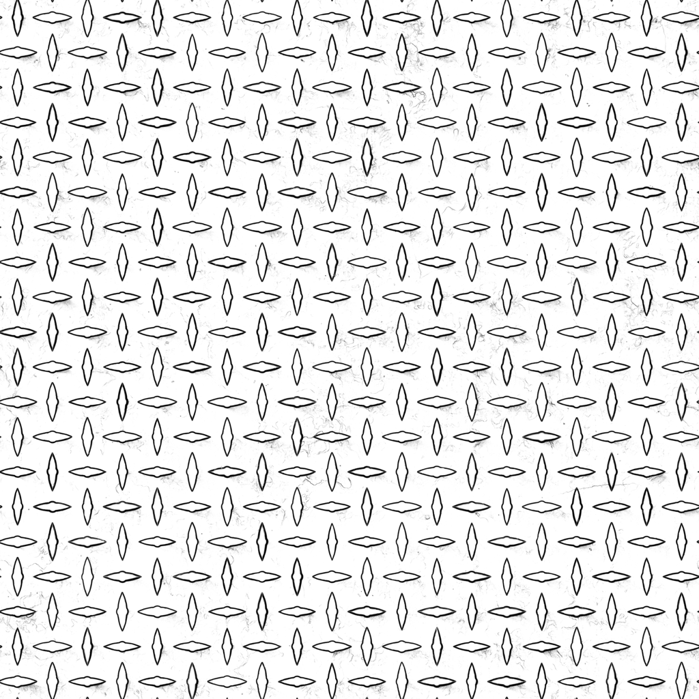
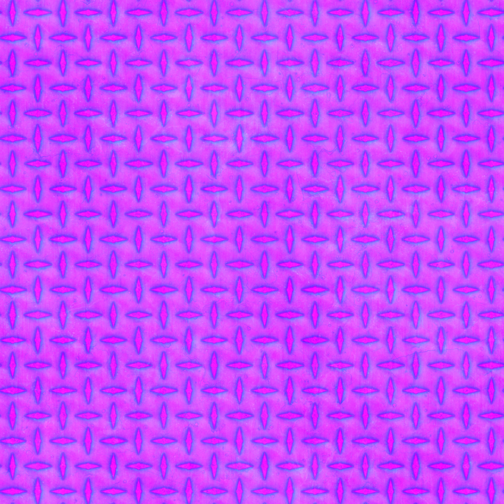

# Texture Packing

轻量级 CLI 工具，支持将多个单通道贴图打包至 RGB/A 通道，输出专为 PBR 材质工作流优化，无运行时依赖，单文件即用。

目前只支持 `.png`

## 使用方法

```bash
texpack --mode rgb inputA.png inputB.png inputC.png output.png
# --mode 可以简化为 -m
texpack -m rgb inputA.png inputB.png inputC.png output.png
```
实际案例

```bash
texpack -m rgb AO.png Rough.png Met.png output_ARM.png
```
R | G | B | 输出
:---: | :---: | :---: | :---:
 |  |  | 

## 模式选择

`--mode` `-m` 后选填参数

`rgb` - 只有 R G B 三个通道

`rgba` - 额外支持 Alpha 通道

## 无图片输入

当某个通道没有所需要的图片，但程序设计要求所有通道都必须得有输入才能正常输出时的解决方法。

### 亮度值输入

假如我们的纹理只有 R G 并没有 B 通道，可以填入 `0` ~ `1` 之间的参数

`0` 代表最暗，`1` 代表最亮，也可以输入 `0.5` `0.7` `0.1` 等中间值

```
texpack -m rgb inputA.png inputB.png 0 output.png

texpack -m rgb inputA.png inputB.png 1 output.png

texpack -m rgb inputA.png inputB.png 0.5 output.png
```

### 预设颜色输入

使用 `black` `white` 作为输入，缺点：这是固定参数，没有直接输入数字来的灵活和方便

```
texpack -m rgb inputA.png inputB.png black output.png

texpack -m rgb inputA.png inputB.png white output.png
```